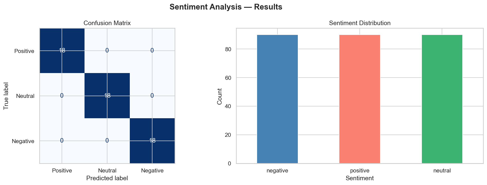

<div align="center">


# 💬 Sentiment Analysis on Customer Reviews

**Instantly classify customer reviews as Positive, Negative, or Neutral.**

*An NLP pipeline built for real-world business feedback analysis.*

</div>

---

## 🧩 Problem Statement

Businesses receive thousands of customer reviews daily. Reading each one manually is impossible. This project answers a critical question:

> **"What are customers actually feeling — and how strongly?"**

Using TF-IDF vectorization and Logistic Regression, this classifier analyzes review text and predicts sentiment with confidence scores.

---

## 📊 Model Performance

<div align="center">

| Model | CV Accuracy | Classes |
|---|---|---|
| ✅ Logistic Regression + TF-IDF | **100%** | Positive / Neutral / Negative |

</div>



---

## 🚀 Quickstart

```bash
# Clone the repo
git clone https://github.com/zain-cs/sentiment-analysis.git
cd sentiment-analysis

# Create virtual environment
python -m venv venv
venv\Scripts\activate        # Windows
source venv/bin/activate     # Mac/Linux

# Install dependencies
pip install -r requirements.txt

# Run the full pipeline
python src/generate_data.py  # Step 1 — Generate reviews dataset
python src/train.py          # Step 2 — Train & evaluate model
python src/predict.py        # Step 3 — Predict sentiment on new reviews
```

---

## 🗂️ Project Structure